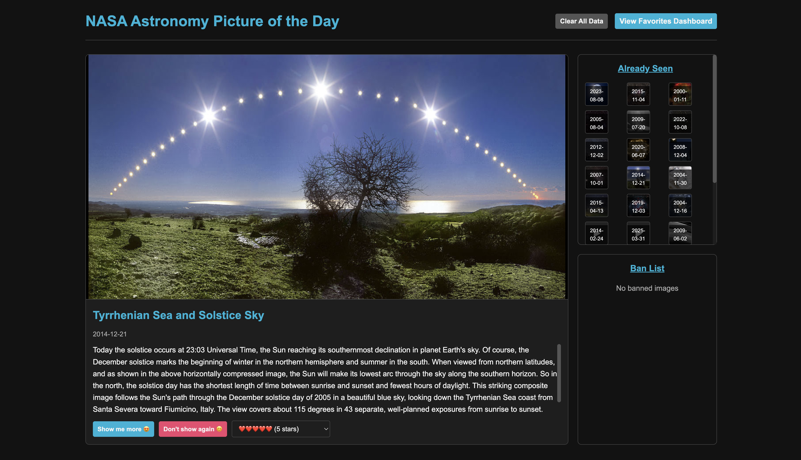

# 🌌 NASA Astronomy Picture of the Day Explorer

A React-based web application that allows users to discover, save, and analyze NASA's Astronomy Pictures of the Day (APOD).

## 📝 Project Description

This project was developed as part of my CodePath Web Development 102 course. It's a responsive single-page application that interfaces with NASA's APOD API to provide users with a curated experience of exploring astronomical images and videos.

## ✨ Features

### Main Explorer View

- Fetch and display random NASA Astronomy Pictures of the Day
- View detailed information about each astronomical image
- Save favorite images with custom ratings (3-5 hearts)
- Ban images you don't want to see again
- Browse your viewing history with thumbnails

### Dashboard & Analytics

- View all your favorite images in a filterable, searchable table
- Filter by author, rating, and media type
- See key statistics about your collection
- Interactive data visualizations with recharts:
  - Rating distribution chart
  - Media type distribution (images vs videos)
  - Top contributors chart
  - Collection timeline chart

### Navigation & User Experience

- Responsive design for all screen sizes
- Detail view for each item with direct URL links
- Toggle between different data visualizations
- Persistent data with localStorage

## 🔗 Live Demo

Check out the live application [here: NASA APOD Explorer 🛸](https://nasa-apoc-hb.vercel.app/)

## 🚀 Technologies Used

- React
- React Router
- Recharts for data visualization
- NASA APOD API
- CSS with responsive design
- localStorage for data persistence

## 💡 Future Improvements

- Implement sharing functionality for favorite images
- Add more advanced filtering options
- Create custom collections/albums for organizing favorites
- Implement a "discover similar" feature based on content preferences

## 💬 Feedback & Social

Found an awe-inspiring astronomy image through this app 🤩? I'd love to see what resonated with you! Tag me on Instagram (@code_techhb) with a screenshot of the image that amazed you the most 😍🔭.

Have suggestions, ideas, or feedback? I'd love to hear from you! Feel free to reach out—I'm always looking for ways to improve my skills 🫶🏾.

## 🙏🏾 Acknowledgements

- [NASA APOD API](https://api.nasa.gov/) for providing the amazing astronomy content
- [CodePath](https://www.codepath.org/) for the web development course
- [Recharts](https://recharts.org/) for the charting library

---

Happy learning n coding! 🚀📚🧠👩🏽‍💻💫
